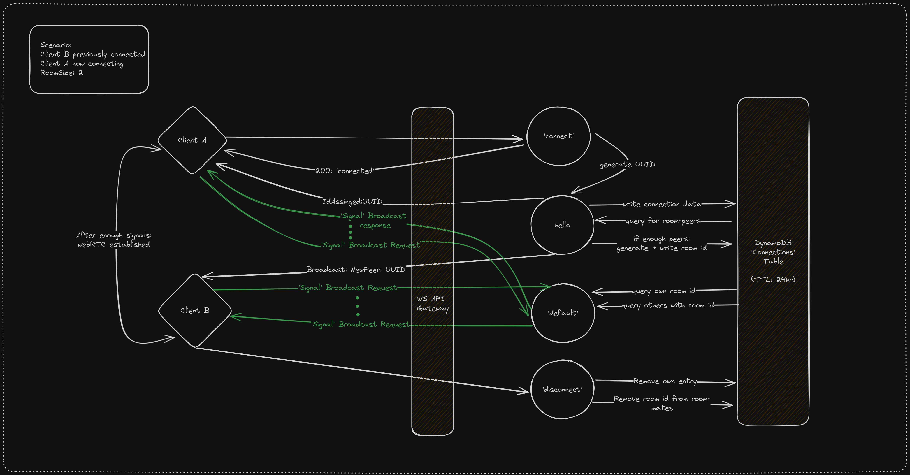

# Serverless Matchbox Signaling Server

This project provides a 'signaling server' for the [matchbox](https://github.com/johanhelsing/matchbox) WebRTC project.

The server is composed of AWS-lambdas and a backing DynamoDB table for state.

## Getting started:
1. Setup [SST](https://docs.sst.dev/setting-up-aws) to deploy to AWS.
2. Clone and `npmm install` this repo
3. Run `npx sst dev`, it'll return you a websocket URL
4. Provide this websocket URL to an app that uses the matchbox protocol and startup 2 clients (eg [the bevy ggrs example](https://github.com/johanhelsing/matchbox/tree/main/examples/bevy_ggrs))

Notes / caveats: 
1. SST's local lambda dev may be oom-killed if your clients are too quick, either start clients more slowly or run `npx sst deploy --stage=prod` to handle the load
2. Currently the default room size is assumed to be 2.

## How it works:
SST is this project's terraform-like infrastructure as code tool. It provisions using AWS's CDK in units called 'Stacks'
Here we use it to provision one stack with several AWS resources, primarily:
1. A DynamoDB 'connections' table
2. 4x lambda handers in `/handlers/`
3. A websocket-based AWS API Gateway, which invokes a lambda on every message

These resources work together to create pub-sub-esque 'rooms' for clients to connect to.

These rooms are used to send enough 'signals' through the signaling server until they can establish a WebRTC connection to each other.

Here's an example of how communications move through each of the 4 lambdas:

